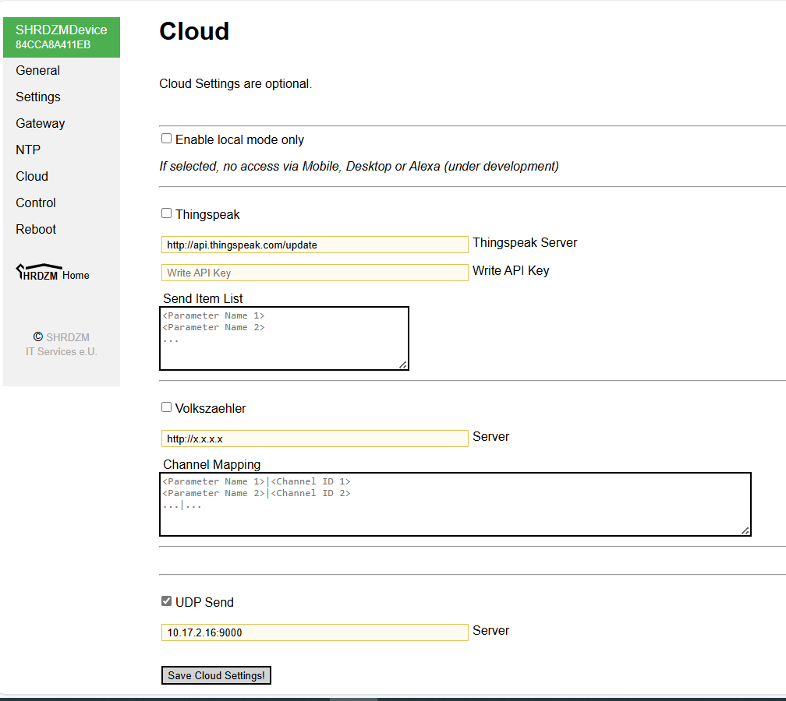

# SHRDZM Adapter Dokumentation

## Übersicht

Der SHRDZM Adapter integriert die SHRDZM Smartmeter-Schnittstelle von *SHRDZM IT Services e.U.* in ioBroker. Dieser Adapter ermöglicht es Ihnen, Energieverbrauchs- und Erzeugungsdaten Ihrer Stromzähler über die SHRDZM-Schnittstelle zu überwachen.

**Wichtiger Hinweis:** Dieser Adapter steht in keinerlei Verbindung zu SHRDZM IT Services e.U. und es besteht keine kommerzielle Beziehung. Dies ist ein unabhängiges Community-Projekt.

## Funktionen

- **Echtzeit-Energieüberwachung**: Empfang von Live-Energieverbrauchs- und Erzeugungsdaten
- **Mehrere OBIS-Code-Unterstützung**: Unterstützt alle Standard-OBIS-Codes für Energiezähler
- **Multi-Geräte-Unterstützung**: Verarbeitung von Daten mehrerer SHRDZM-Geräte gleichzeitig
- **Historische Daten**: Konfigurierbare Aktualisierungsraten für Energie- und Leistungsdatenhistorie
- **UDP-Weiterleitung**: Weiterleitung empfangener Daten an andere Systeme
- **Gerätefilterung**: Optionale Filterung zur Annahme von Daten nur bestimmter Geräte
- **Rohdatenspeicherung**: Option zum Speichern roher UDP-Pakete für Analysen

## Installation

**⚠️ Wichtiger Installationshinweis**

Installieren Sie diesen Adapter **NICHT** mit npm (`npm install iobroker.shrdzm`). ioBroker-Adapter dürfen **niemals** direkt mit npm installiert werden.

**Korrekte Installationsmethode:**
1. Öffnen Sie die ioBroker Admin-Oberfläche
2. Navigieren Sie zum "Adapter"-Tab
3. Suchen Sie nach "SHRDZM" oder durchsuchen Sie die verfügbaren Adapter
4. Klicken Sie auf den "+"-Button, um den Adapter zu installieren
5. Konfigurieren Sie die Adapter-Instanz wie unten beschrieben

## SHRDZM Geräte-Setup

### Hardware-Anforderungen
- SHRDZM Smartmeter-Schnittstellengerät
- Stromzähler, der mit der SHRDZM-Schnittstelle kompatibel ist
- Netzwerkverbindung für das SHRDZM-Gerät
- ioBroker-Host im selben Netzwerk

### SHRDZM Gerätekonfiguration

1. **Installieren und verbinden Sie Ihr SHRDZM-Gerät** gemäß der Herstellerdokumentation
2. **Zugriff auf die SHRDZM-Konfigurationsoberfläche** über einen Webbrowser:
   - Verbinden Sie sich mit der Web-Oberfläche Ihres SHRDZM-Geräts
   - Navigieren Sie zur Konfigurationsseite

3. **Cloud-Einstellungen konfigurieren**:
   
   - Wählen Sie "Cloud-Konfiguration" in der SHRDZM-Oberfläche
   - Im Feld "Server" geben Sie ein:
     - **IP-Adresse**: IPv4-Adresse Ihres ioBroker-Hosts
     - **Port**: Die im Adapter konfigurierte Portnummer (Standard: 9000)
   - **Aktivieren Sie "UDP senden"**
   - **Speichern** Sie die Cloud-Einstellungen

4. **Aktualisierungsintervall konfigurieren**:
   - Navigieren Sie zur "Einstellungen"-Seite in der SHRDZM-Oberfläche
   - Stellen Sie Ihr gewünschtes Datenübertragungsintervall ein
   - Speichern Sie die Einstellungen

Das SHRDZM-Gerät beginnt sofort, Daten an Ihren ioBroker-Adapter im konfigurierten Intervall zu senden.

## Adapter-Konfiguration

### Grundkonfiguration

1. **Öffnen Sie die ioBroker Admin-Oberfläche**
2. **Navigieren Sie zu "Instanzen"**
3. **Finden Sie Ihre SHRDZM-Adapter-Instanz** und klicken Sie auf den Konfigurationsbutton

#### Netzwerkeinstellungen

- **Bind-IP-Adresse**: 
  - Standard: `0.0.0.0` (auf allen Netzwerkschnittstellen lauschen)
  - Auf spezifische IP setzen, wenn Sie die verwendete Netzwerkschnittstelle beschränken möchten
- **Port**: 
  - Standard: `9000`
  - Wählen Sie eine beliebige freie Portnummer (1-65535)
  - Muss mit dem in Ihrem SHRDZM-Gerät konfigurierten Port übereinstimmen

#### Gerätefilterung (Optional)

- **Geräte**: 
  - Leer lassen, um Daten von allen SHRDZM-Geräten zu akzeptieren
  - Spezifische Geräte-IDs eingeben (kommagetrennt), um Geräte zu filtern
  - Geräte-ID-Format: z.B. `84CCA8A411EB`

### Erweiterte Konfiguration

#### Aktualisierungsraten

- **Aktualisierungsrate für Energieinformationen**: 
  - Steuert, wie oft Energiedaten für die Historie verarbeitet werden
  - Höhere Werte reduzieren die Systemlast, aber verringern die Datenauflösung
  - Beispiel: Einstellung auf 15 bedeutet, dass jeder 15. Datenpunkt für die Historie verwendet wird

- **Aktualisierungsrate für Leistungsinformationen**:
  - Steuert, wie oft Leistungsdaten für die Historie verarbeitet werden
  - Ähnlich wie Energierate, aber für momentane Leistungswerte

#### Datenverarbeitungsoptionen

- **Rohdaten speichern**: 
  - Aktivieren, um rohe UDP-Pakete von Geräten zu speichern
  - Nützlich für Debugging und Datenanalyse
  - **Warnung**: Erhöht die Systemlast durch häufige Updates

#### UDP-Weiterleitung

- **UDP-Weiterleitung aktivieren**: Empfangene Daten an ein anderes System weiterleiten
- **UDP-Weiterleitungsadresse**: Ziel-IP-Adresse für die Weiterleitung
- **UDP-Weiterleitungsport**: Zielport für die Weiterleitung

## Vom Adapter erstellte Datenpunkte

Der Adapter erstellt Datenpunkte für alle empfangenen OBIS-Codes. Nachfolgend eine vollständige Liste der unterstützten Datenpunkte:

### Geräteinformationen
- `<geräteId>.info.connection` - Verbindungsstatus des Geräts
- `<geräteId>.info.lastSeen` - Zeitstempel der letzten empfangenen Daten
- `<geräteId>.uptime` - Geräte-Laufzeitinformationen

### Energieverbrauch (Bezug)
- `<geräteId>.1.8.0` - Gesamte verbrauchte Wirkenergie (Wh)
- `<geräteId>.1.8.1` - Verbrauchte Wirkenergie Tarif 1 (NT - Niedertarif) (Wh)
- `<geräteId>.1.8.2` - Verbrauchte Wirkenergie Tarif 2 (HT - Hochtarif) (Wh)

### Energieerzeugung (Einspeisung)
- `<geräteId>.2.8.0` - Gesamte erzeugte Wirkenergie (Wh)
- `<geräteId>.2.8.1` - Erzeugte Wirkenergie Tarif 1 (NT) (Wh)
- `<geräteId>.2.8.2` - Erzeugte Wirkenergie Tarif 2 (HT) (Wh)

### Blindenergie
- `<geräteId>.3.8.0` - Gesamte verbrauchte Blindenergie (Var)
- `<geräteId>.4.8.0` - Gesamte erzeugte Blindenergie (Var)

### Momentanleistung
- `<geräteId>.1.7.0` - Aktuelle verbrauchte Wirkleistung (W)
- `<geräteId>.2.7.0` - Aktuelle erzeugte Wirkleistung (W)
- `<geräteId>.3.7.0` - Aktuelle verbrauchte Blindleistung (Var)
- `<geräteId>.4.7.0` - Aktuelle erzeugte Blindleistung (Var)
- `<geräteId>.16.7.0` - Aktuelle Gesamtleistung (Netzsaldo) (W)

### Spitzenleistungswerte
- `<geräteId>.1.6.0` - Spitzenleistung verbraucht (15-Minuten-Maximum) (W)
- `<geräteId>.2.6.0` - Spitzenleistung erzeugt (15-Minuten-Maximum) (W)

### Rohdaten (falls aktiviert)
- `<geräteId>.rawData` - Rohe UDP-Paketdaten wie vom Gerät empfangen

**Hinweis**: `<geräteId>` wird durch die tatsächliche Geräte-ID ersetzt (z.B. `84CCA8A411EB`)

## Fehlerbehebung

### Keine Daten empfangen

1. **Netzwerkkonfiguration prüfen**:
   - Stellen Sie sicher, dass SHRDZM-Gerät und ioBroker im selben Netzwerk sind
   - Überprüfen Sie, ob IP-Adresse und Port-Einstellungen zwischen Gerät und Adapter übereinstimmen
   - Prüfen Sie die Firewall-Einstellungen auf dem ioBroker-Host

2. **SHRDZM-Konfiguration überprüfen**:
   - Bestätigen Sie, dass "UDP senden" in den SHRDZM-Cloud-Einstellungen aktiviert ist
   - Prüfen Sie, dass die korrekte ioBroker-IP und der Port konfiguriert sind
   - Überprüfen Sie, dass das Datenübertragungsintervall angemessen eingestellt ist

3. **Adapter-Logs prüfen**:
   - Setzen Sie den Adapter-Log-Level auf "debug" oder "silly"
   - Suchen Sie nach UDP-Empfangsnachrichten in den Logs
   - Prüfen Sie auf Fehlermeldungen

### Hohe Systemlast

1. **Aktualisierungsraten anpassen**:
   - Erhöhen Sie die Energie- und Leistungsaktualisierungsratenwerte
   - Dies reduziert die Häufigkeit der historischen Datenverarbeitung

2. **Rohdatenspeicherung deaktivieren**:
   - Schalten Sie die Option "Rohdaten speichern" aus, falls nicht benötigt
   - Rohdatenspeicherung verursacht häufige Datenpunkt-Updates

3. **Gerätefilterung**:
   - Verwenden Sie Gerätefilterung, um nur bestimmte Geräte zu verarbeiten
   - Reduziert die Verarbeitungslast bei mehreren vorhandenen Geräten

### Datenaktualisierungen zu häufig

- Passen Sie das Übertragungsintervall in den SHRDZM-Geräteeinstellungen an
- Erhöhen Sie die Aktualisierungsraten in der Adapter-Konfiguration
- Überlegen Sie, ob Echtzeit-Updates für Ihren Anwendungsfall notwendig sind

## Support und Mitwirkung

### Community-Support
Für Fragen, Probleme und Community-Diskussionen besuchen Sie bitte unser Forum-Thema:
[https://forum.iobroker.net/topic/80297/test-adapter-shrzdm](https://forum.iobroker.net/topic/80297/test-adapter-shrzdm)

### Fehlermeldungen
Bitte melden Sie Bugs und Feature-Anfragen auf GitHub:
[https://github.com/mcm4iob/ioBroker.shrdzm/issues](https://github.com/mcm4iob/ioBroker.shrdzm/issues)

### Mitwirkung
Beiträge sind willkommen! Bitte:
1. Forken Sie das Repository
2. Erstellen Sie einen Feature-Branch
3. Machen Sie Ihre Änderungen
4. Reichen Sie einen Pull Request ein

### Spende
**Wenn Ihnen dieser Adapter gefällt, freuen wir uns über eine Spende:**
  

## Technische Informationen

### OBIS-Code-Standard
Dieser Adapter folgt dem OBIS (Object Identification System) Standard für die Identifikation von Energiezählerdaten. OBIS-Codes bieten eine standardisierte Möglichkeit, verschiedene Arten von Energiemessungen zu identifizieren.

### Datenformat
Der Adapter empfängt JSON-formatierte UDP-Pakete mit:
- Geräte-ID
- Zeitstempel
- OBIS-Code-Werte
- Geräte-Laufzeit

### Netzwerkprotokoll
- **Protokoll**: UDP (User Datagram Protocol)
- **IP-Version**: Nur IPv4
- **Datenformat**: JSON
- **Port-Bereich**: Konfigurierbar (1-65535)

## Lizenz

Dieser Adapter ist unter der MIT-Lizenz lizenziert. Siehe die LICENSE-Datei im Repository für vollständige Details.

---

*Diese Dokumentation wurde zuletzt für Adapter-Version 1.0.0 aktualisiert*